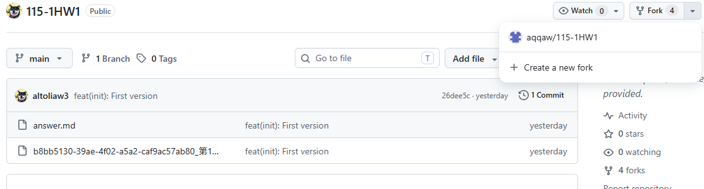

# 第1次作業題目-隨堂-HW1
>
>學號：1234567 (換成自己的)
> 
>姓名：王小明 (換成自己的)
> 
>作業撰寫時間：180 (mins，包含程式撰寫時間，換成自己的)
> 
>最後撰寫文件日期：2023/09/22 (換成自己的)
>

1.

Ans:
>
>用老師給Github倉庫連結點擊**Fork**至個人倉庫
>

2. 

Ans:

# 標題
### 在行首使用1到6個#並加上一個空格,#越多字體越小,#最多6個
> 
># h1
>### h3
>###### h6
>

# 文字效果
### 前後文本加*或是_變為斜體
>
>*斜體*
> 
>_斜體_
>
### 前後文本加**或是__變為粗體
>
>**粗體**
> 
>__粗體__
>
# 清單
### 無序清單:在行首使用-,*或是+,加上空格,渲染後呈現圓點
>
>- 清單
>* 清單
>+ 清單
>
### 有序清單:行首輸入數字加句點加空格,顯示時自動排列成1,2,3...,數字就算不按數字排列還是會被修正為順序排列,並且第一個項目的數字決定清單起始值
>
>1. 清單
>2. 清單
>3. 清單
>

>
>2. 清單
>4. 清單
>6. 清單
>
# 圖片

# 引用
>引用
>>引用
>>>引用

# 鏈接
 亞東[aeust首頁](https://portal.aeust.edu.tw/)

3.
Ans:

4. 

*Ans:*

## 其他